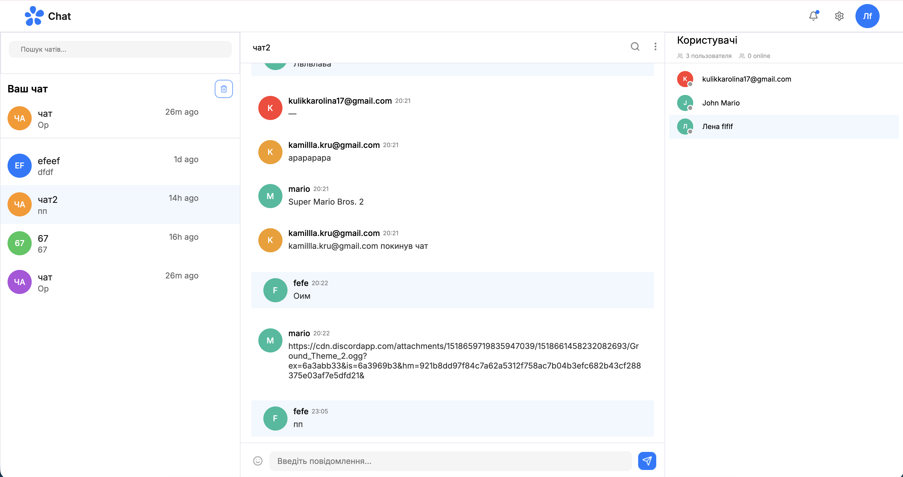
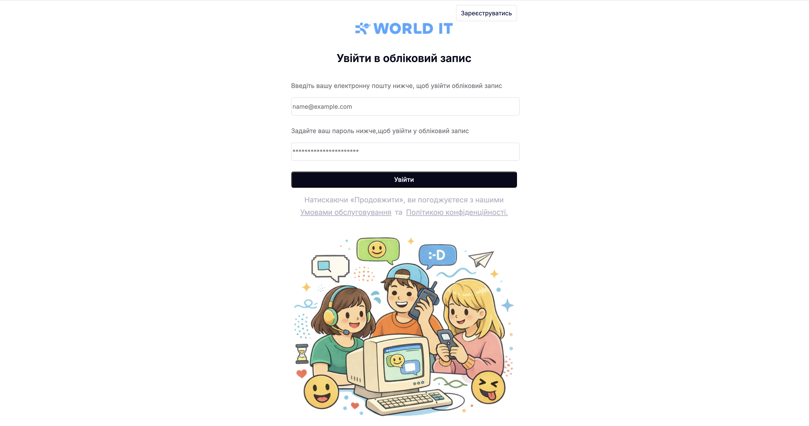
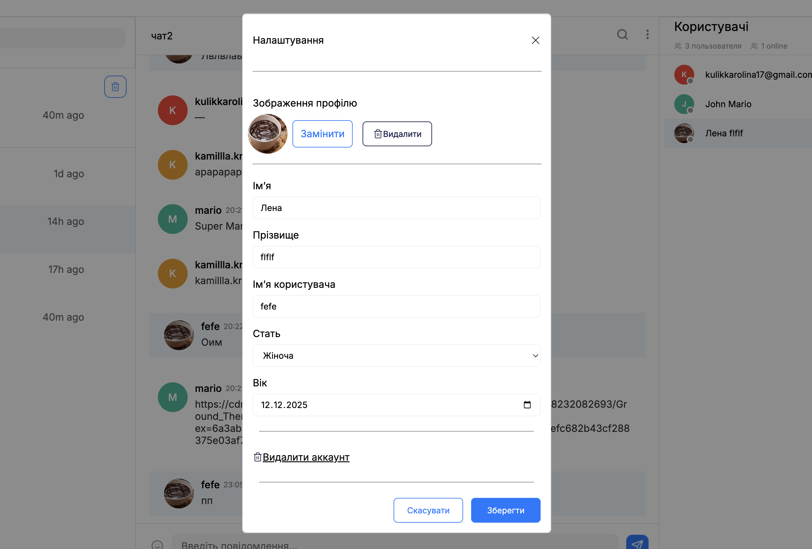
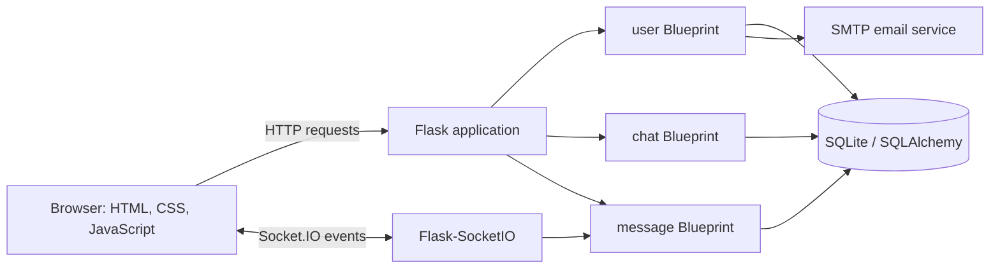
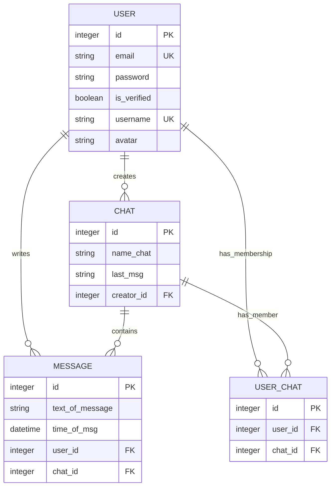
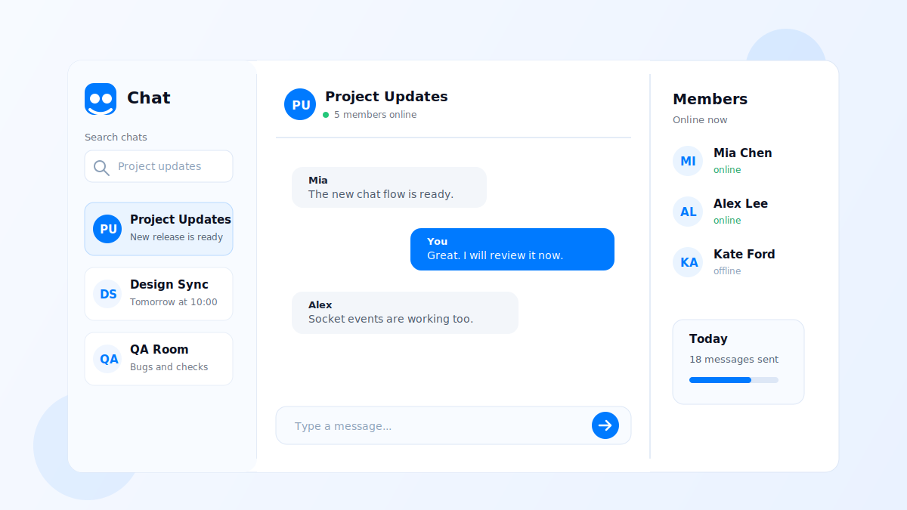

# Chat Project

[](https://www.python.org/)
[](https://flask.palletsprojects.com/)
[](https://socket.io/)
[](https://www.sqlite.org/)

Вебзастосунок для групового спілкування в реальному часі: реєстрація та підтвердження email, профіль користувача, пошук і керування чатами, повідомлення через Socket.IO та online/offline-статуси учасників.

[Відкрити англійську версію](#english-version)

## Зміст

- [Про проєкт](#about)
- [Мета та практична цінність](#purpose)
- [Склад команди](#team)
- [Функціональні можливості](#features)
- [Зображення проєкту](#visuals)
- [Зміст проєкту: модулі, застосунки та їхні ролі](#project-content)
- [Архітектура та потоки даних](#architecture)
- [Модель даних](#data-model)
- [Технології та залежності](#technology)
- [Повна структура проєкту](#structure)
- [Швидкий запуск](#quick-start)
- [Змінні оточення](#environment)
- [Маршрути та Socket.IO-події](#interfaces)
- [Експлуатаційні примітки](#operations)
- [Висновок і подальший розвиток](#conclusion)
- [English version — one-click translation](#english-version)

<a id="about"></a>

## Про проєкт

Chat Project — серверний вебзастосунок для комунікації у групових чатах. Після реєстрації користувач підтверджує адресу email, входить до системи, налаштовує власний профіль, створює або знаходить чат і надсилає повідомлення без перезавантаження сторінки. Дані користувачів, чатів, зв'язків між ними та повідомлень зберігаються у SQLite; двосторонній обмін подіями виконується через Flask-SocketIO.

Поточний продукт зосереджений на базовому, але цілісному сценарії групового спілкування: один користувач може бути учасником кількох чатів, а кожне повідомлення належить конкретному автору та чату.

<a id="purpose"></a>

## Мета та практична цінність

Мета проєкту — реалізувати зрозумілу архітектуру реального вебзастосунку, у якому разом працюють автентифікація, реляційна база даних, email-підтвердження, серверний інтерфейс і WebSocket-події.

Для розробника, який починає працювати з Flask, репозиторій корисний як практичний орієнтир:

- показує, як розділяти застосунок на незалежні Flask Blueprints;
- демонструє зв'язки між моделями SQLAlchemy і міграції Alembic;
- пояснює повний життєвий цикл сесії: реєстрація, верифікація, вхід і вихід;
- містить приклад інтеграції Socket.IO-кімнат для доставки повідомлень у реальному часі;
- поєднує Python-бекенд, Jinja-шаблони та JavaScript-клієнт в одному робочому потоці.

<a id="team"></a>

## Склад команди

| Учасник | Роль у репозиторії | GitHub |
| --- | --- | --- |
| Lena Fedchenko | TeamLead | [@LenaFedchenko](https://github.com/LenaFedchenko) |
| Karolina Kulik | python developer | [@karolina1909](https://github.com/karolina1909) |
| Sasha Peunkov | python developer | [@sasha3363](https://github.com/sasha3363) |

<a id="features"></a>

## Функціональні можливості

### Облікові записи та безпека

- реєстрація за email і паролем;
- хешування паролів засобами Werkzeug;
- вхід через Flask-Login і збереження авторизованої сесії;
- надсилання листа з посиланням для підтвердження email;
- оновлення персональних даних: ім'я, прізвище, нікнейм, стать і дата народження;
- завантаження, заміна та видалення аватара;
- видалення власного облікового запису.

### Чати та учасники

- створення чату авторизованим користувачем;
- перегляд чатів, у яких користувач є учасником;
- пошук чатів за назвою без перезавантаження сторінки;
- приєднання до знайденого чату;
- вихід із чату;
- видалення чату його автором;
- відображення списку учасників і кількості користувачів online.

### Повідомлення в реальному часі

- приєднання браузера до Socket.IO-кімнати конкретного чату;
- завантаження збереженої історії повідомлень після відкриття чату;
- миттєва доставка нового повідомлення всім учасникам відкритої кімнати;
- збереження тексту, автора, часу та чату для кожного повідомлення;
- оновлення online/offline-статусу при підключенні або відключенні користувача;
- показ часу останнього повідомлення в списку чатів.

<a id="visuals"></a>

## Зображення проєкту

Зображення нижче дає загальне уявлення про робочий простір: ліворуч розміщено навігацію чатами, у центрі — активне листування, праворуч — панель учасників та їхній статус.


### Сторінка авторизації

### Сторінка налаштувань



<a id="project-content"></a>

## Зміст проєкту: модулі, застосунки та їхні ролі

Проєкт побудований з чотирьох логічних модулів. Кожен із них має чітко визначену відповідальність, що спрощує навігацію кодом, тестування та подальше розширення.

### `project/` — ядро застосунку

Модуль об'єднує загальні налаштування та зв'язує всі частини системи в єдиний Flask-застосунок.

| Файл або каталог | Роль |
| --- | --- |
| `settings.py` | Створює Flask-застосунок, налаштовує папки статичних файлів і шаблонів, ініціалізує об'єкт `SocketIO`. |
| `urls.py` | Підключає Blueprints `user`, `chat`, `message` і реєструє HTTP-маршрути. |
| `db.py` | Визначає підключення SQLAlchemy до SQLite та налаштовує Flask-Migrate. |
| `login.py` | Налаштовує `LoginManager`, секретний ключ сесії та завантаження користувача за ідентифікатором. |
| `loadenv.py` | Завантажує `.env` і виконує налаштовані команди міграцій під час старту. |
| `templates/base.html` | Базовий шаблон, який містить спільний каркас сторінки й модальне вікно налаштувань профілю. |
| `static/` | Спільні стилі, JavaScript і графічні ресурси. |
| `migrations/` | Конфігурація Alembic і версії міграцій схеми даних. |

### `user/` — ідентифікація та профіль користувача

Модуль відповідає за все, що пов'язано з обліковим записом. Він створює нового користувача, зберігає пароль у захищеному вигляді, відправляє лист для верифікації, забезпечує вхід до системи та керує даними профілю.

| Компонент | Роль |
| --- | --- |
| `app.py` | Описує Blueprint `user` і шляхи до власних шаблонів та статичних ресурсів. |
| `model.py` | Містить модель `User`, поля профілю, зв'язки з чатами й повідомленнями та інтеграцію з `UserMixin`. |
| `views.py` | Реалізує реєстрацію, вхід, верифікацію email, видалення акаунта та рендеринг сторінок авторизації. |
| `send_email.py` | Формує HTML-лист і відправляє його через SMTP Gmail із вбудованим зображенням. |
| `templates/` | Містить сторінки реєстрації, входу та повідомлення про відправлення листа. |
| `static/` | Містить стилі адаптивних сторінок авторизації, логотип та ілюстрацію для email-листа. |

### `chat/` — робочий простір і керування чатами

Модуль формує головний екран після входу. Він показує доступні користувачу чати, створює чат, знаходить чат за назвою, приєднує учасників і керує профілем через інтерфейс робочого простору.

| Компонент | Роль |
| --- | --- |
| `app.py` | Описує Blueprint `chat`. |
| `model.py` | Визначає `Chat` та проміжну модель `UserChat` для зв'язку користувачів і чатів. |
| `views.py` | Рендерить чат, отримує та зберігає дані профілю, обробляє аватари, створює, шукає, додає та видаляє чати. |
| `templates/chat.html` | Головна сторінка листування: список чатів, активна розмова, форма надсилання та блок учасників. |
| `templates/particles/` | Повторно використовувані частини інтерфейсу: картки чатів, стани порожнього списку, модальні вікна створення, виходу й видалення. |
| `static/js/` | Керує модальними вікнами, пошуком чатів і взаємодією з профілем у браузері. |
| `static/css/` | Стилі лівої навігаційної панелі, області повідомлень, панелі учасників, модальних вікон та адаптивної верстки. |

### `message/` — повідомлення та подієвий обмін

Модуль відповідає за стан реального часу. Він не створює окремої HTML-сторінки: його JavaScript підключається до робочого простору чату, а серверні обробники Socket.IO синхронізують дані між усіма активними клієнтами.

| Компонент | Роль |
| --- | --- |
| `app.py` | Описує Blueprint `message` і зберігає перелік поточних online-підключень. |
| `model.py` | Визначає модель `Message`: текст, час відправлення, автора та чат. |
| `socket.py` | Обробляє підключення, відключення, вхід/вихід із Socket.IO-кімнат, історію, надсилання повідомлень і статуси учасників. |
| `static/js/openChat.js` | Відкриває чат, приєднує користувача до кімнати, завантажує історію та надсилає повідомлення. |
| `static/js/leavingChat.js` | Виконує вихід користувача з чату й Socket.IO-кімнати. |
| `static/js/users.js` | Запитує та відображає склад чату й online/offline-стан учасників. |

### Кореневі ресурси

| Ресурс | Роль |
| --- | --- |
| `manage.py` | Точка входу: імпортує проєкт, виконує стартові дії та запускає Socket.IO-сервер на порту `7060`. |
| `requirements.txt` | Зафіксований перелік залежностей Python. |
| `.env.example` | Шаблон секретів і команд роботи з міграціями. |
| `docs/chat-preview.svg` | Векторний preview інтерфейсу, який використано у цьому README. |

<a id="architecture"></a>

## Архітектура та потоки даних



### HTTP-потік

1. Браузер надсилає форму реєстрації або входу до модуля `user`.
2. Після успішної автентифікації Flask-Login зберігає ідентифікатор користувача в сесії.
3. Маршрут `/` передає авторизованого користувача до модуля `chat`, який формує головний екран із доступними чатами.
4. Операції профілю та керування чатами надходять до відповідних view-функцій, змінюють SQLAlchemy-моделі й зберігаються в SQLite.

### Подієвий потік реального часу

1. Після відкриття інтерфейсу браузер підключається до Socket.IO.
2. Під час вибору чату клієнт надсилає `join_room` із `chat_id`; сервер додає з'єднання до кімнати `room-{chat_id}`.
3. Сервер повертає історію повідомлень, список учасників і їхні поточні статуси.
4. Подія `message` зберігає нове повідомлення у БД і транслює його всім клієнтам відповідної кімнати.
5. Події `disconnect` та `leave_room` синхронізують статус присутності і склад чату.

<a id="data-model"></a>

## Модель даних

| Сутність | Основні дані | Зв'язки |
| --- | --- | --- |
| `User` | email, хеш пароля, статус верифікації, дані профілю, аватар | має багато повідомлень; пов'язаний із багатьма чатами через `UserChat` |
| `Chat` | назва, ініціали/зображення, останнє повідомлення, ID автора | має багато повідомлень; містить багато учасників через `UserChat` |
| `Message` | текст, дата і час, ID чату, ID автора | належить одному `User` і одному `Chat` |
| `UserChat` | ID користувача, ID чату | проміжна таблиця для зв'язку «багато-до-багатьох» |



<a id="technology"></a>

## Технології та залежності

| Напрям | Використані технології | Призначення |
| --- | --- | --- |
| Мова та вебфреймворк | Python, Flask | HTTP-запити, шаблони, Blueprints і конфігурація застосунку |
| Інтерфейс | Jinja2, HTML5, CSS3, JavaScript | Рендеринг сторінок, адаптивна верстка та поведінка інтерфейсу |
| Реальний час | Flask-SocketIO, python-socketio, python-engineio | Двосторонній обмін подіями та кімнати чатів |
| Дані | SQLite, SQLAlchemy, Flask-SQLAlchemy | Збереження користувачів, чатів, повідомлень і зв'язків |
| Міграції | Alembic, Flask-Migrate | Контроль і застосування змін у схемі БД |
| Автентифікація | Flask-Login, Werkzeug | Сесії користувачів та безпечне хешування паролів |
| Конфігурація | python-dotenv | Завантаження секретів і команд із `.env` |
| Email | `smtplib`, `email` | Надсилання HTML-листа для підтвердження акаунта |

<a id="structure"></a>

## Повна структура проєкту

```text
chat_project/
├── manage.py                              # точка входу та запуск Socket.IO
├── requirements.txt                       # залежності Python
├── .env.example                           # приклад конфігурації оточення
├── .gitignore                             # виключення для Git
├── README.md                              # документація проєкту
├── docs/
│   └── chat-preview.svg                   # зображення загального інтерфейсу
├── project/
│   ├── __init__.py                        # імпорт і збирання застосунку
│   ├── settings.py                        # Flask і Socket.IO налаштування
│   ├── urls.py                            # HTTP-маршрути та Blueprints
│   ├── db.py                              # SQLAlchemy та Flask-Migrate
│   ├── login.py                           # Flask-Login і сесії
│   ├── loadenv.py                         # .env і стартові міграції
│   ├── instance/
│   │   └── data.db                        # SQLite-база даних
│   ├── migrations/
│   │   ├── alembic.ini                    # конфігурація Alembic
│   │   ├── env.py                         # середовище міграцій
│   │   ├── script.py.mako                 # шаблон міграції
│   │   ├── README                         # довідка Alembic
│   │   └── versions/
│   │       ├── 07fdb1db477d_.py           # початкова схема
│   │       └── 1ca648bd357a_.py           # міграція поля avatar
│   ├── templates/
│   │   └── base.html                      # спільний шаблон сторінки
│   └── static/
│       ├── css/
│       │   ├── base.css                   # базові стилі
│       │   ├── header.css                 # верхня частина інтерфейсу
│       │   ├── modal.css                  # спільні модальні вікна
│       │   └── media.css                  # адаптивна верстка
│       ├── js/
│       │   └── modal.js                   # поведінка модального вікна профілю
│       └── images/
│           ├── close.png                  # закриття модального вікна
│           ├── repeat.png                 # службова піктограма
│           └── trash.png                  # видалення
├── user/
│   ├── __init__.py
│   ├── app.py                             # Blueprint user
│   ├── model.py                           # модель User
│   ├── views.py                           # логіка акаунта й профілю
│   ├── send_email.py                      # відправлення email-підтвердження
│   ├── templates/
│   │   ├── register.html                  # реєстрація
│   │   ├── login.html                     # вхід
│   │   └── success.html                   # підтвердження відправлення листа
│   └── static/
│       ├── css/
│       │   ├── register.css               # форми реєстрації та входу
│       │   ├── success.css                # сторінка після відправлення листа
│       │   └── media.css                  # адаптивні стилі
│       └── images/
│           ├── img_friends.png            # ілюстрація в email-листі
│           └── logo.png                   # логотип
├── chat/
│   ├── __init__.py
│   ├── app.py                             # Blueprint chat
│   ├── model.py                           # моделі Chat і UserChat
│   ├── views.py                           # логіка робочого простору чату
│   ├── templates/
│   │   ├── chat.html                      # головна сторінка чатів
│   │   └── particles/
│   │       ├── all-chats.html             # список доступних чатів
│   │       ├── create-chat.html           # форма створення чату
│   │       ├── created-chat.html          # картка створеного чату
│   │       ├── modal-del.html             # підтвердження видалення
│   │       ├── modal-leaving.html         # підтвердження виходу
│   │       ├── no-chats.html              # порожній стан списку
│   │       └── settings-account.html      # налаштування профілю
│   └── static/
│       ├── css/
│       │   ├── chat.css                   # центральна область листування
│       │   ├── create-chat.css            # створення чату
│       │   ├── delete-chat.css            # видалення та вихід
│       │   ├── left.css                   # ліва панель навігації
│       │   ├── media.css                  # адаптивні стилі
│       │   └── right.css                  # права панель учасників
│       ├── js/
│       │   ├── modalAvatar.js             # керування аватаром
│       │   ├── modalCreateChat.js         # модальне вікно чату
│       │   └── searching.js               # асинхронний пошук
│       ├── images/
│       │   ├── avatar.png                 # аватар за замовчуванням
│       │   ├── back.png                   # повернення
│       │   ├── bin.png                    # видалення
│       │   ├── close.png                  # закриття
│       │   ├── emoji.png                  # emoji
│       │   ├── logo.svg                   # логотип чату
│       │   ├── more.png                   # додаткові дії
│       │   ├── noone.svg                  # порожній стан
│       │   ├── notif.svg                  # сповіщення
│       │   ├── people.png                 # учасники
│       │   ├── search.png                 # пошук
│       │   ├── send.png                   # надсилання повідомлення
│       │   └── settings.svg               # налаштування
│       └── uploads/
│           └── 1782161603_images.jpeg     # приклад локального завантаження
└── message/
    ├── __init__.py
    ├── app.py                             # Blueprint і online_users
    ├── model.py                           # модель Message
    ├── socket.py                          # Socket.IO-обробники
    └── static/js/
        ├── openChat.js                    # відкриття кімнати й обмін повідомленнями
        ├── leavingChat.js                 # вихід із кімнати/чату
        └── users.js                       # учасники та статуси
```

Службові каталоги віртуального середовища (`.venv/`, `venv/`), кеш Python (`__pycache__/`), локальний файл `.env` і налаштування редактора не входять до функціональної структури застосунку та не повинні змінювати вихідний код продукту.

<a id="quick-start"></a>

## Швидкий запуск

### Передумови

- Python 3.10 або новішої версії;
- `pip`;
- обліковий запис SMTP із паролем застосунку, якщо потрібне підтвердження email;
- доступний порт `7060` на локальному комп'ютері.

### 1. Клонування репозиторію

```bash
git clone https://github.com/LenaFedchenko/chat_project.git
cd chat_project
```

### 2. Віртуальне середовище

macOS / Linux:

```bash
python3 -m venv .venv
source .venv/bin/activate
```

Windows PowerShell:

```powershell
py -m venv .venv
.venv\Scripts\Activate.ps1
```

### 3. Встановлення залежностей

```bash
python -m pip install --upgrade pip
python -m pip install -r requirements.txt
```

### 4. Налаштування оточення

macOS / Linux:

```bash
cp .env.example .env
```

Windows PowerShell:

```powershell
Copy-Item .env.example .env
```

Відкрийте `.env` і задайте значення, описані в розділі [Змінні оточення](#environment).

### 5. Старт застосунку

```bash
python manage.py
```

Після успішного запуску відкрийте [http://127.0.0.1:7060](http://127.0.0.1:7060) у браузері. Реєстрація доступна за адресою `/register/`, а вхід — за `/login/`.

<a id="environment"></a>

## Змінні оточення

Створіть файл `.env` на основі `.env.example`:

```env
SECRET_TOKEN=replace-with-a-long-random-secret
EMAIL_SENDER=your-email@gmail.com
PASSWORD_KEY=your-email-app-password

DB_INIT=flask --app manage.py db init
DB_MIGRATE=flask --app manage.py db migrate
DB_UPGRADE=flask --app manage.py db upgrade
```

| Змінна | Призначення | Вимога |
| --- | --- | --- |
| `SECRET_TOKEN` | Секретний ключ Flask для підписування сесій. | Обов'язкова; використовуйте довге випадкове значення. |
| `EMAIL_SENDER` | Адреса відправника листів для підтвердження. | Потрібна для email-верифікації. |
| `PASSWORD_KEY` | Пароль застосунку SMTP-акаунта. | Потрібний для email-верифікації; не використовуйте основний пароль пошти. |
| `DB_INIT` | Команда первинної ініціалізації Alembic. | Використовується, якщо каталог міграцій відсутній. |
| `DB_MIGRATE` | Команда створення міграції на основі змін моделей. | Читається стартовим скриптом. |
| `DB_UPGRADE` | Команда застосування доступних міграцій. | Читається стартовим скриптом. |

Файл `.env` вже виключений у `.gitignore`. Не публікуйте реальні токени, паролі або дані поштового акаунта в комітах, задачах чи скриншотах.

<a id="interfaces"></a>

## Маршрути та Socket.IO-події

### HTTP-маршрути

| Метод | Маршрут | Призначення |
| --- | --- | --- |
| `GET`, `POST` | `/register/` | Реєстрація користувача. |
| `GET`, `POST` | `/login/` | Вхід до системи. |
| `GET`, `POST` | `/success/` | Сторінка після надсилання листа підтвердження. |
| `GET`, `POST` | `/check_email/` | Підтвердження email за посиланням із листа. |
| `GET`, `POST` | `/` | Головний робочий простір чатів для авторизованого користувача. |
| `POST` | `/get-data/` | Оновлення полів профілю. |
| `POST` | `/change-photo/` | Завантаження нового аватара. |
| `POST` | `/delete-avatar/` | Видалення аватара. |
| `GET`, `POST` | `/del-user/` | Видалення облікового запису. |
| `POST` | `/create-chat/` | Створення нового чату. |
| `POST` | `/del-chat/` | Видалення чату, створеного поточним користувачем. |
| `GET` | `/search/` | Пошук чатів за назвою. |
| `POST` | `/add-chat/` | Приєднання поточного користувача до чату. |
| `POST` | `/send-data-users/` | Отримання даних профілю учасника. |

### Socket.IO-події

| Подія | Напрям | Призначення |
| --- | --- | --- |
| `connect` / `disconnect` | клієнт → сервер | Фіксує активне Socket.IO-підключення та змінює online-статус. |
| `join_room` | клієнт → сервер | Додає клієнта до кімнати чату, повертає історію та статуси учасників. |
| `message` | двостороння | Зберігає і транслює нове повідомлення учасникам кімнати. |
| `leave_room` | клієнт → сервер | Видаляє користувача з чату або видаляє чат, якщо виходить його автор. |
| `leave_socket_room` | клієнт → сервер | Від'єднує браузер від Socket.IO-кімнати без зміни складу чату. |
| `get_users` | двостороння | Передає клієнту перелік учасників чату. |
| `load_messages` | сервер → клієнт | Передає збережену історію повідомлень після відкриття чату. |
| `status_user` | сервер → клієнт | Передає статуси учасників і кількість online-користувачів. |
| `user_status_changed` | сервер → клієнт | Повідомляє про підключення або відключення користувача. |

<a id="operations"></a>

## Експлуатаційні примітки

- Застосунок запускається на `127.0.0.1:7060` у режимі розробки.
- Поточне сховище — SQLite, тому воно підходить для локального запуску та невеликих інсталяцій. Для масштабованого розгортання варто перейти на керовану серверну БД, наприклад PostgreSQL.
- Email-підтвердження використовує SMTP Gmail на порту `587` із TLS. Для Gmail потрібен пароль застосунку.
- Каталог `chat/static/uploads/` використовується для аватарів. У production-оточенні його доцільно замінити об'єктним сховищем із перевіркою типу та розміру файлів.
- Перед публічним розгортанням потрібно вимкнути режим `debug`, задати безпечний секретний ключ, обмежити допустимі завантаження, увімкнути HTTPS і додати автоматизовані тести.

<a id="conclusion"></a>

## Висновок і подальший розвиток

Chat Project реалізує повний користувацький сценарій групового спілкування: від створення облікового запису до обміну збереженими повідомленнями в реальному часі. Робота з проєктом дає практичне розуміння модульної будови Flask, об'єктно-реляційного моделювання, сесійної автентифікації, SMTP-інтеграції та подієвої взаємодії через Socket.IO.

Подальший розвиток може включати:

- ролі, дозволи та модерацію учасників;
- запрошення до приватних чатів;
- редагування, видалення, реакції та вкладення у повідомленнях;
- пагінацію історії, індикатор набору тексту й push-сповіщення;
- тести для моделей, HTTP-маршрутів і Socket.IO-подій;
- CI/CD, логування, моніторинг та production-конфігурацію;
- PostgreSQL, Redis і масштабування Socket.IO для кількох інстансів застосунку.

---

<a id="english-version"></a>

<details>
<summary><strong>English version — click once to open the full translation</strong></summary>

# Chat Project — English Documentation

## Contents

- [About the project](#about-en)
- [Purpose and practical value](#purpose-en)
- [Team](#team-en)
- [Features](#features-en)
- [Project visuals](#visuals-en)
- [Project content: modules, applications, and roles](#project-content-en)
- [Architecture and data flows](#architecture-en)
- [Data model](#data-model-en)
- [Technology stack](#technology-en)
- [Complete project structure](#structure-en)
- [Quick start](#quick-start-en)
- [Environment variables](#environment-en)
- [Routes and Socket.IO events](#interfaces-en)
- [Operational notes](#operations-en)
- [Conclusion and next steps](#conclusion-en)

<a id="about-en"></a>

## About the project

Chat Project is a server-rendered web application for real-time group communication. A user registers and confirms an email address, signs in, completes a profile, creates or discovers a chat, and exchanges messages without refreshing the page. Users, chats, memberships, and messages are persisted in SQLite, while Flask-SocketIO handles bidirectional events.

The current product focuses on a complete baseline group-chat flow: a user can belong to multiple chats, and every message is associated with one author and one chat.

<a id="purpose-en"></a>

## Purpose and practical value

The project demonstrates a clear architecture for a real web application in which authentication, a relational database, email confirmation, server-rendered views, and WebSocket events work together.

It is a useful practical reference for developers new to Flask because it:

- separates responsibilities into focused Flask Blueprints;
- demonstrates SQLAlchemy relationships and Alembic migrations;
- follows the session lifecycle from registration and verification to sign-in;
- integrates Socket.IO rooms for real-time chat delivery;
- combines a Python backend, Jinja templates, and JavaScript client behavior in one workflow.

<a id="team-en"></a>

## Team

| Member | Repository role | GitHub |
| --- | --- | --- |
| Lena Fedchenko | Project author and maintainer | [@LenaFedchenko](https://github.com/LenaFedchenko) |

> This table lists the contributor confirmed by this repository's Git history. Add every future team member together with their role and GitHub profile.

<a id="features-en"></a>

## Features

### Accounts and security

- Email-and-password registration.
- Password hashing through Werkzeug.
- Session management with Flask-Login.
- SMTP confirmation email containing a verification link.
- Editable first name, last name, username, gender, and date of birth.
- Avatar upload, replacement, and removal.
- Account deletion.

### Chats and members

- Chat creation by an authenticated user.
- A list of chats in which the current user is a member.
- Asynchronous search by chat name.
- Joining a discovered chat and leaving a chat.
- Chat deletion by its creator.
- Participant list and count of online users.

### Real-time messaging

- Browser connection to a Socket.IO room for an individual chat.
- Persisted message history loaded when a chat is opened.
- Instant delivery of new messages to all clients in the room.
- Storage of message text, author, timestamp, and chat reference.
- Online/offline presence updates on connection changes.
- Last-message time shown in the chat list.

<a id="visuals-en"></a>

## Project visuals

The image presents the main workspace: chat navigation on the left, an active conversation in the center, and participants with their presence state on the right.



> **IMAGE PLACEHOLDER 1 — authentication.** Add a registration or sign-in screenshot at `docs/screenshots/authentication.png`.

> **IMAGE PLACEHOLDER 2 — profile.** Add a profile-settings and avatar modal screenshot at `docs/screenshots/profile-settings.png`.

> **IMAGE PLACEHOLDER 3 — chat workspace.** Add a screenshot of the chat list, messages, and participant panel at `docs/screenshots/chat-workspace.png`.

<a id="project-content-en"></a>

## Project content: modules, applications, and roles

The repository is organized into four logical modules. Each owns a focused responsibility, making the codebase easier to navigate, test, and extend.

### `project/` — application core

This module holds shared configuration and connects the system into a single Flask application.

| File or directory | Role |
| --- | --- |
| `settings.py` | Creates the Flask application, configures static/template folders, and initializes `SocketIO`. |
| `urls.py` | Connects the `user`, `chat`, and `message` Blueprints and registers HTTP routes. |
| `db.py` | Defines the SQLAlchemy SQLite connection and Flask-Migrate integration. |
| `login.py` | Configures `LoginManager`, the session secret key, and user loading by ID. |
| `loadenv.py` | Loads `.env` and runs configured migration commands on startup. |
| `templates/base.html` | Shared page shell with the profile settings modal. |
| `static/` | Shared CSS, JavaScript, and image resources. |
| `migrations/` | Alembic configuration and schema migration versions. |

### `user/` — identity and user profile

This module owns the account lifecycle. It creates users, stores hashed passwords, sends verification messages, signs users in, and maintains profile data.

| Component | Role |
| --- | --- |
| `app.py` | Defines the `user` Blueprint and its resource locations. |
| `model.py` | Contains the `User` model, profile fields, relationships, and `UserMixin` integration. |
| `views.py` | Implements registration, sign-in, email verification, account deletion, and authentication page rendering. |
| `send_email.py` | Builds and sends the HTML confirmation message through Gmail SMTP. |
| `templates/` | Registration, sign-in, and confirmation-sent pages. |
| `static/` | Responsive authentication styles, logo, and the email illustration. |

### `chat/` — workspace and chat management

This module produces the signed-in application's main screen. It presents the user's chats, creates chats, finds chats by name, adds members, and exposes profile-related UI inside the workspace.

| Component | Role |
| --- | --- |
| `app.py` | Defines the `chat` Blueprint. |
| `model.py` | Defines `Chat` and the `UserChat` membership relation. |
| `views.py` | Renders the workspace; manages profile details and avatars; creates, searches, joins, and deletes chats. |
| `templates/chat.html` | The main chat page: chat list, active conversation, send form, and participants panel. |
| `templates/particles/` | Reusable UI sections for chat cards, empty states, and creation/leaving/deletion modals. |
| `static/js/` | Client-side modal, search, and profile interactions. |
| `static/css/` | Styles for navigation, messages, participants, modal dialogs, and responsive layouts. |

### `message/` — messages and event exchange

This module owns real-time state. It does not render its own HTML page: its JavaScript is included by the chat workspace, while Socket.IO handlers synchronize active clients.

| Component | Role |
| --- | --- |
| `app.py` | Defines the `message` Blueprint and stores active user connections. |
| `model.py` | Defines `Message`: text, send time, author, and chat. |
| `socket.py` | Handles connections, disconnections, rooms, history, new messages, and participant status events. |
| `static/js/openChat.js` | Opens a chat, joins its room, loads history, and sends messages. |
| `static/js/leavingChat.js` | Leaves a chat and its Socket.IO room. |
| `static/js/users.js` | Requests and renders participants and their online/offline state. |

### Root resources

| Resource | Role |
| --- | --- |
| `manage.py` | Entry point: imports the project, runs startup work, and launches Socket.IO on port `7060`. |
| `requirements.txt` | Pinned Python dependency list. |
| `.env.example` | Template for secrets and migration commands. |
| `docs/chat-preview.svg` | Vector interface preview shown in this README. |

<a id="architecture-en"></a>

## Architecture and data flows


### HTTP flow

1. The browser submits registration or sign-in data to the `user` module.
2. On successful authentication, Flask-Login stores the user ID in the session.
3. The `/` route passes an authenticated user to the `chat` module, which renders the workspace and available chats.
4. Profile and chat-management requests reach the relevant view functions, update SQLAlchemy models, and persist in SQLite.

### Real-time event flow

1. On opening the interface, the browser creates a Socket.IO connection.
2. When the user selects a chat, the client emits `join_room` with a `chat_id`; the server adds the connection to `room-{chat_id}`.
3. The server returns message history, membership data, and current presence states.
4. The `message` event saves a message in the database and broadcasts it to every client in that room.
5. `disconnect` and `leave_room` synchronize the presence state and chat membership.

<a id="data-model-en"></a>

## Data model

| Entity | Core data | Relationships |
| --- | --- | --- |
| `User` | email, password hash, verification state, profile fields, avatar | owns many messages; belongs to many chats through `UserChat` |
| `Chat` | name, initials/image, last message, creator ID | owns many messages; contains many members through `UserChat` |
| `Message` | text, timestamp, chat ID, author ID | belongs to one `User` and one `Chat` |
| `UserChat` | user ID, chat ID | junction table for the many-to-many relationship |


<a id="technology-en"></a>

## Technology stack

| Area | Technologies | Purpose |
| --- | --- | --- |
| Language and web framework | Python, Flask | HTTP requests, templates, Blueprints, and application configuration |
| Interface | Jinja2, HTML5, CSS3, JavaScript | Page rendering, responsive layout, and client behavior |
| Real time | Flask-SocketIO, python-socketio, python-engineio | Bidirectional events and chat rooms |
| Data | SQLite, SQLAlchemy, Flask-SQLAlchemy | Persistence for users, chats, messages, and relations |
| Migrations | Alembic, Flask-Migrate | Versioning and applying schema changes |
| Authentication | Flask-Login, Werkzeug | User sessions and secure password hashing |
| Configuration | python-dotenv | Loading secrets and commands from `.env` |
| Email | `smtplib`, `email` | Sending the account-confirmation email |

<a id="structure-en"></a>

## Complete project structure

```text
chat_project/
├── manage.py                              # entry point and Socket.IO start
├── requirements.txt                       # Python dependencies
├── .env.example                           # environment configuration example
├── .gitignore                             # Git exclusions
├── README.md                              # project documentation
├── docs/
│   └── chat-preview.svg                   # overall interface preview
├── project/
│   ├── __init__.py                        # application assembly imports
│   ├── settings.py                        # Flask and Socket.IO configuration
│   ├── urls.py                            # HTTP routes and Blueprints
│   ├── db.py                              # SQLAlchemy and Flask-Migrate
│   ├── login.py                           # Flask-Login and sessions
│   ├── loadenv.py                         # .env and startup migrations
│   ├── instance/
│   │   └── data.db                        # SQLite database
│   ├── migrations/
│   │   ├── alembic.ini                    # Alembic configuration
│   │   ├── env.py                         # migration environment
│   │   ├── script.py.mako                 # migration template
│   │   ├── README                         # Alembic reference
│   │   └── versions/
│   │       ├── 07fdb1db477d_.py           # initial schema
│   │       └── 1ca648bd357a_.py           # avatar field migration
│   ├── templates/
│   │   └── base.html                      # shared page template
│   └── static/
│       ├── css/
│       │   ├── base.css                   # base styles
│       │   ├── header.css                 # interface header
│       │   ├── modal.css                  # shared modal dialog styles
│       │   └── media.css                  # responsive layout
│       ├── js/
│       │   └── modal.js                   # profile-modal behavior
│       └── images/
│           ├── close.png                  # modal close icon
│           ├── repeat.png                 # utility icon
│           └── trash.png                  # delete icon
├── user/
│   ├── __init__.py
│   ├── app.py                             # user Blueprint
│   ├── model.py                           # User model
│   ├── views.py                           # account and profile logic
│   ├── send_email.py                      # confirmation email sender
│   ├── templates/
│   │   ├── register.html                  # registration
│   │   ├── login.html                     # sign-in
│   │   └── success.html                   # email-sent confirmation
│   └── static/
│       ├── css/
│       │   ├── register.css               # registration and sign-in forms
│       │   ├── success.css                # post-email page
│       │   └── media.css                  # responsive styles
│       └── images/
│           ├── img_friends.png            # email illustration
│           └── logo.png                   # logo
├── chat/
│   ├── __init__.py
│   ├── app.py                             # chat Blueprint
│   ├── model.py                           # Chat and UserChat models
│   ├── views.py                           # chat-workspace logic
│   ├── templates/
│   │   ├── chat.html                      # main chat page
│   │   └── particles/
│   │       ├── all-chats.html             # available-chat list
│   │       ├── create-chat.html           # chat-creation form
│   │       ├── created-chat.html          # created-chat card
│   │       ├── modal-del.html             # delete confirmation
│   │       ├── modal-leaving.html         # leave confirmation
│   │       ├── no-chats.html              # empty-list state
│   │       └── settings-account.html      # profile settings
│   └── static/
│       ├── css/
│       │   ├── chat.css                   # central messaging area
│       │   ├── create-chat.css            # chat creation
│       │   ├── delete-chat.css            # deletion and leaving
│       │   ├── left.css                   # navigation panel
│       │   ├── media.css                  # responsive styles
│       │   └── right.css                  # participant panel
│       ├── js/
│       │   ├── modalAvatar.js             # avatar management
│       │   ├── modalCreateChat.js         # chat modal
│       │   └── searching.js               # asynchronous search
│       ├── images/
│       │   ├── avatar.png                 # default avatar
│       │   ├── back.png                   # back action
│       │   ├── bin.png                    # deletion
│       │   ├── close.png                  # close action
│       │   ├── emoji.png                  # emoji action
│       │   ├── logo.svg                   # chat logo
│       │   ├── more.png                   # more actions
│       │   ├── noone.svg                  # empty state
│       │   ├── notif.svg                  # notifications
│       │   ├── people.png                 # participants
│       │   ├── search.png                 # search
│       │   ├── send.png                   # message sending
│       │   └── settings.svg               # settings
│       └── uploads/
│           └── 1782161603_images.jpeg     # sample local upload
└── message/
    ├── __init__.py
    ├── app.py                             # message Blueprint and online users
    ├── model.py                           # Message model
    ├── socket.py                          # Socket.IO handlers
    └── static/js/
        ├── openChat.js                    # room opening and messaging
        ├── leavingChat.js                 # room/chat leaving
        └── users.js                       # participants and statuses
```

Virtual environments (`.venv/`, `venv/`), Python caches (`__pycache__/`), the local `.env` file, and editor settings are deliberately outside the application's functional source structure.

<a id="quick-start-en"></a>

## Quick start

### Prerequisites

- Python 3.10 or newer;
- `pip`;
- an SMTP account with an application password if email verification is enabled;
- local port `7060` available.

### 1. Clone the repository

```bash
git clone https://github.com/LenaFedchenko/chat_project.git
cd chat_project
```

### 2. Create and activate a virtual environment

macOS / Linux:

```bash
python3 -m venv .venv
source .venv/bin/activate
```

Windows PowerShell:

```powershell
py -m venv .venv
.venv\Scripts\Activate.ps1
```

### 3. Install dependencies

```bash
python -m pip install --upgrade pip
python -m pip install -r requirements.txt
```

### 4. Configure the environment

macOS / Linux:

```bash
cp .env.example .env
```

Windows PowerShell:

```powershell
Copy-Item .env.example .env
```

Edit `.env` according to [Environment variables](#environment-en).

### 5. Start the application

```bash
python manage.py
```

When the server starts, open [http://127.0.0.1:7060](http://127.0.0.1:7060). Registration is available at `/register/`; sign-in is available at `/login/`.

<a id="environment-en"></a>

## Environment variables

Create `.env` from `.env.example`:

```env
SECRET_TOKEN=replace-with-a-long-random-secret
EMAIL_SENDER=your-email@gmail.com
PASSWORD_KEY=your-email-app-password

DB_INIT=flask --app manage.py db init
DB_MIGRATE=flask --app manage.py db migrate
DB_UPGRADE=flask --app manage.py db upgrade
```

| Variable | Purpose | Requirement |
| --- | --- | --- |
| `SECRET_TOKEN` | Flask secret used to sign sessions. | Required; use a long random value. |
| `EMAIL_SENDER` | Sender address for confirmation messages. | Required for email verification. |
| `PASSWORD_KEY` | SMTP account application password. | Required for email verification; do not use the primary mailbox password. |
| `DB_INIT` | Alembic initialization command. | Used if the migrations directory is absent. |
| `DB_MIGRATE` | Command that creates a migration from model changes. | Read by the startup script. |
| `DB_UPGRADE` | Command that applies available migrations. | Read by the startup script. |

`.env` is excluded by `.gitignore`. Never commit actual tokens, passwords, or email-account credentials.

<a id="interfaces-en"></a>

## Routes and Socket.IO events

### HTTP routes

| Method | Route | Purpose |
| --- | --- | --- |
| `GET`, `POST` | `/register/` | User registration. |
| `GET`, `POST` | `/login/` | Account sign-in. |
| `GET`, `POST` | `/success/` | Page shown after confirmation email is sent. |
| `GET`, `POST` | `/check_email/` | Verifies email through the message link. |
| `GET`, `POST` | `/` | Main chat workspace for the authenticated user. |
| `POST` | `/get-data/` | Updates profile fields. |
| `POST` | `/change-photo/` | Uploads a new avatar. |
| `POST` | `/delete-avatar/` | Removes the avatar. |
| `GET`, `POST` | `/del-user/` | Deletes the account. |
| `POST` | `/create-chat/` | Creates a chat. |
| `POST` | `/del-chat/` | Deletes a chat created by the current user. |
| `GET` | `/search/` | Searches chats by name. |
| `POST` | `/add-chat/` | Adds the current user to a chat. |
| `POST` | `/send-data-users/` | Returns a participant profile. |

### Socket.IO events

| Event | Direction | Purpose |
| --- | --- | --- |
| `connect` / `disconnect` | client → server | Records the active Socket.IO connection and updates presence. |
| `join_room` | client → server | Joins a chat room and returns history plus participant statuses. |
| `message` | bidirectional | Persists and broadcasts a new message to room participants. |
| `leave_room` | client → server | Removes a user from a chat or deletes the chat when its creator leaves. |
| `leave_socket_room` | client → server | Leaves the Socket.IO room without changing chat membership. |
| `get_users` | bidirectional | Returns chat participants to the client. |
| `load_messages` | server → client | Sends persisted history after a chat is opened. |
| `status_user` | server → client | Sends participant statuses and online count. |
| `user_status_changed` | server → client | Notifies clients when a user connects or disconnects. |

<a id="operations-en"></a>

## Operational notes

- The application starts on `127.0.0.1:7060` in development mode.
- SQLite is appropriate for local runs and small installations. A managed server database such as PostgreSQL is preferable for a scalable deployment.
- Email confirmation uses Gmail SMTP on port `587` with TLS and requires an application password.
- `chat/static/uploads/` stores avatars. A production deployment should use object storage together with file type and file size validation.
- Before a public deployment, disable `debug`, use a secure secret, restrict uploads, enable HTTPS, and add automated tests.

<a id="conclusion-en"></a>

## Conclusion and next steps

Chat Project implements an end-to-end group communication flow, from account creation to persisted real-time messages. Working with it gives practical insight into modular Flask design, object-relational modeling, session authentication, SMTP integration, and Socket.IO event-driven communication.

The next development stages may include:

- participant roles, permissions, and moderation;
- private-chat invitations;
- message editing, deletion, reactions, and attachments;
- history pagination, typing indicators, and push notifications;
- tests for models, HTTP routes, and Socket.IO events;
- CI/CD, logging, monitoring, and production configuration;
- PostgreSQL, Redis, and multi-instance Socket.IO scaling.

</details>
